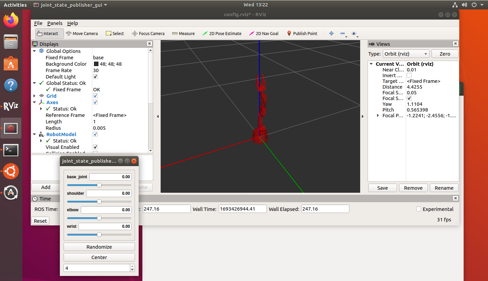

# robotArm-task2

to run a simulated robot arm in ROS, you can follow thses instructions:


assuming you already have your Ubntu and ROS installed, open the terminal and run the following commands:


---
### create a ROS workspace
create a new directory for your ROS workspace <br>
``` mkdir -p ~/catkin_ws/src ``` <br>
go to the directory <br>
``` cd ~/catkin_ws/src ``` <br>
configure your workspace <br>
``` catkin_make ``` 

### clone required packages
go to src folder <br>
``` cd ~/catkin_ws/src ``` <br>
clone the required packages, you can use arduino_robot_arm provided by @smart-methods <br>
``` git clone https://github.com/smart-methods/arduino_robot_arm.git ```

### install dependencies
``` cd ~/catkin_ws ``` <br>
``` rosdep install --from-paths src --ignore-src -r -y ``` <br>
for ROS melodic distro (you can replace melodic with the one youre working with) <br>
``` sudo apt-get install ros-melodic-moveit ``` <br>
``` sudo apt-get install ros-melodic-joint-state-publisher ros-melodic-joint-state-publisher-gui ``` <br>
``` sudo apt-get install ros-melodic-gazebo-ros-control joint-state-publisher ``` <br>
``` sudo apt-get install ros-melodic-ros-controllers ros-melodic-ros-control ```

### open and edit .bashrc file
open .bashrc file <br>
``` sudo nano ~/.bashrc ``` <br>
add the following line to the end of file, and replace username with your own username <br>
``` source /home/username/catkin_ws/devel/setup.bash ``` <br>
press Ctrl+O, Enter, Ctrl+X <br>
update .bashrc file <br>
``` source ~/catkin_ws/devel/setup.bash ```

### launch the robot arm
finally, run this command to launch the robot arm <br>
``` roslaunch robot_arm_pkg check_motors.launch ``` <br>
this will launch the robot arm on RViz, a 3D visualization tool for ROS. you can now manipulate and control the robot arm 

---
### result



